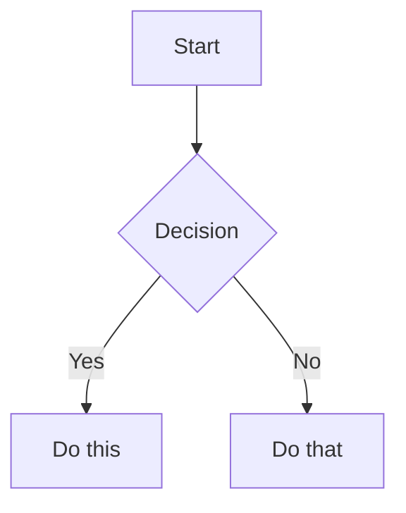

# Obsidian Flavored Markdown Reference

Obsidian extends CommonMark and GitHub Flavored Markdown with wikilinks, embeds, callouts, properties, and other vault-specific syntax. This reference covers only Obsidian-specific extensions — standard Markdown (headings, bold, italic, lists, code blocks, tables) is assumed knowledge.

## Wikilinks (Internal Links)

Use wikilinks for all links within the vault. Obsidian tracks renames automatically.

```markdown
[[Note Name]]                          Link to a note
[[Note Name|Display Text]]             Custom display text
[[Note Name#Heading]]                  Link to a specific heading
[[Note Name#^block-id]]                Link to a specific block
[[Note Name#^block-id|Display Text]]   Link to block with custom text
[[#Heading in same note]]              Link to heading in current note
```

Define a block ID by appending `^block-id` at the end of a paragraph:

```markdown
This paragraph can be linked to. ^my-block-id
```

For lists or quotes, place the block ID on a separate line after the block:

```markdown
> A quote block

^quote-id
```

Use `[text](url)` for external URLs only — not for vault notes.

## Embeds

Prefix any wikilink with `!` to embed content inline:

```markdown
![[Note Name]]                         Embed full note
![[Note Name#Heading]]                 Embed a specific section
![[image.png]]                         Embed an image
![[image.png|300]]                     Embed image with pixel width
![[document.pdf#page=3]]               Embed a specific PDF page
![[audio.mp3]]                         Embed audio player
```

## Callouts

Callouts highlight information with a colored block and icon:

```markdown
> [!note]
> Basic callout with default title.

> [!warning] Custom Title
> Callout with a custom title.

> [!tip]- Collapsed by default
> Use `-` after the type to collapse. Use `+` to expand by default.

> [!faq]+ Expanded by default
> Starts open.
```

Common callout types: `note`, `tip`, `info`, `warning`, `danger`, `bug`, `success`, `failure`, `question`, `example`, `quote`, `abstract`, `todo`.

Callouts can be nested:

```markdown
> [!note] Outer
> > [!tip] Inner
> > Nested callout content.
```

## Properties (Frontmatter)

Properties are YAML metadata in a `---` delimited block at the top of the file:

```yaml
---
title: My Note
date: 2024-01-15
tags:
  - project
  - active
aliases:
  - Alternative Name
cssclasses:
  - custom-class
status: in-progress
priority: 2
done: false
---
```

**Common property types:**

| Type | YAML example |
|------|-------------|
| Text | `status: "active"` |
| Number | `priority: 2` |
| Date | `due: 2024-03-01` |
| Boolean | `done: false` |
| List | `tags:\n  - item1\n  - item2` |
| Link | `related: "[[Other Note]]"` |

**Built-in Obsidian properties:**
- `tags` — searchable labels (`#tag` syntax, also works inline in body)
- `aliases` — alternative note names for link suggestions
- `cssclasses` — CSS classes applied to the note in reading view

## Tags

```markdown
#tag                    Inline tag in body text
#nested/tag             Nested tag (creates hierarchy)
```

Tags can also be defined in frontmatter under `tags`. Rules: letters, numbers (not first char), underscores, hyphens, and forward slashes.

## Comments

Comments are hidden in reading view:

```markdown
This is visible %%but this is hidden%% text.

%%
This entire block is hidden in reading view.
%%
```

## Highlights

```markdown
==This text is highlighted==
```

## Math (LaTeX)

```markdown
Inline: $e^{i\pi} + 1 = 0$

Block:
$$
\frac{a}{b} = c
$$
```

## Diagrams (Mermaid)

````markdown

````

To link Mermaid nodes to Obsidian notes, add `class NodeName internal-link;`.

## Footnotes

```markdown
Text with a footnote[^1].

[^1]: Footnote content goes here.

Inline footnote.^[This is the inline footnote text.]
```

## Complete Note Example

````markdown
---
title: Project Alpha
date: 2024-01-15
tags:
  - project
  - active
status: in-progress
---

# Project Alpha

This project aims to [[improve workflow]] using modern techniques.

> [!important] Key Deadline
> The first milestone is due on ==January 30th==.

## Tasks

- [x] Initial planning
- [ ] Development phase

## Notes

The algorithm uses $O(n \log n)$ sorting. See [[Algorithm Notes#Sorting]] for details.

![[Architecture Diagram.png|600]]

Reviewed in [[Meeting Notes 2024-01-10#Decisions]].
````

## Using This Knowledge with MCP Tools

When creating or editing notes through this MCP server, apply these patterns:

- Read a note (see its markdown): `obsidian_read({ file: "Note Name" })`
- Create a note with frontmatter:
  ```
  obsidian_create({
    name: "New Note",
    content: "---\ntags:\n  - project\nstatus: active\n---\n# Heading\n\nContent here."
  })
  ```
- Append a callout to daily note:
  ```
  obsidian_daily_append({ content: "> [!tip] Reminder\n> Don't forget the meeting." })
  ```
- Set a frontmatter property: `obsidian_property_set({ name: "status", value: "done", file: "Note Name" })`
- Search by tag: `obsidian_search({ query: "tag:#project" })`
- Find notes linking to another: `obsidian_backlinks({ file: "Note Name" })`
